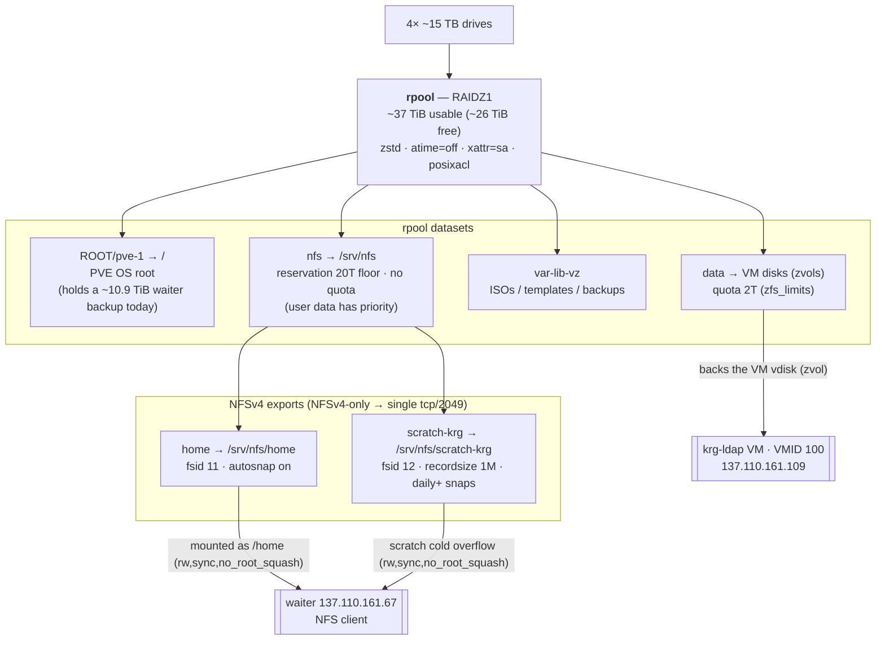
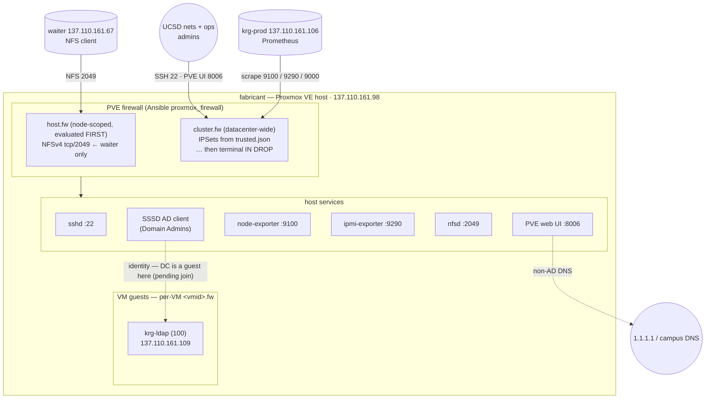

# fabricant — storage & network topology

Reference diagrams for **fabricant**, the Proxmox VE **hypervisor** (137.110.161.98).
Unlike waiter/krg-ldap, fabricant is configured by the **Ansible** layer, not the
flake. It backs the lab's NFS (`/home` + scratch cold tier) and hosts the NixOS
VMs — notably the `krg-ldap` AD DC.

- Inventory: [`ansible/inventory/hosts.yml`](../ansible/inventory/hosts.yml) · [`host_vars/fabricant.yml`](../ansible/inventory/host_vars/fabricant.yml)
- Plays: [`ansible/playbooks/site.yml`](../ansible/playbooks/site.yml)
- Roles: [`nfs_server`](../ansible/roles/nfs_server) · [`zfs_limits`](../ansible/roles/zfs_limits) · [`proxmox_firewall`](../ansible/roles/proxmox_firewall)

> **Related:** [waiter](waiter-topology.md) · [krg-ldap](krg-ldap-topology.md). `krg-prod`
> (137.110.161.106) runs Prometheus; `waiter` (137.110.161.67) is the physical
> NFS client. Ansible currently runs **on the box** (`ansible_connection: local`).

---

## Storage

One ZFS pool, `rpool`, backs **everything**: the PVE OS root, the VM disks, and
the NFS exports. The capacity policy is *user data > VM data* — NFS gets a 20 TiB
reservation floor while the VM-disk dataset is capped, so guests can't crowd out
user data.

| dataset | mount | role | limit |
|---|---|---|---|
| `rpool/ROOT/pve-1` | `/` | PVE OS root (+ current waiter backup) | — |
| `rpool/data` | — (zvols) | VM disks | **quota 2T** (zfs_limits) |
| `rpool/var-lib-vz` | `/var/lib/vz` | ISOs / templates / backups | (uncapped; optional 1T) |
| `rpool/nfs` | `/srv/nfs` | NFS export parent | **reservation 20T**, no quota |
| `rpool/nfs/home` | `/srv/nfs/home` | AD user homes (fsid 11) | inherits; autosnap on |
| `rpool/nfs/scratch-krg` | `/srv/nfs/scratch-krg` | waiter scratch cold overflow (fsid 12) | recordsize 1M |

> `no_root_squash` on both exports is deliberate: waiter's `pam_mkhomedir` (home)
> and the `scratch-overflow` job (scratch) run as **root** on the client and must
> create/chown files preserving owner/group. Both exports are scoped to waiter's IP only. The
> former generic `bulk` export is retired (`zfs destroy rpool/nfs/bulk` once
> confirmed empty — done out-of-band).

---

## Network

fabricant's firewall is the **Proxmox perimeter** (Ansible `proxmox_firewall`),
three nested layers. It pairs with the in-guest NixOS firewalls on the VMs — it
owns *which sources* reach a guest/host; it does not replace the guest layer. The
breach that drove this rebuild was root SSH open to `+dc/public` here; that is now
UCSD/ops-only.

### Inbound rules (PVE firewall)

| port | service | source | layer |
|---|---|---|---|
| 2049/tcp | NFSv4 | **waiter only** (137.110.161.67) | host.fw (first) |
| 22/tcp | SSH | `ucsd` + `ops` IPSets | cluster.fw |
| 8006/tcp | PVE web UI | `ucsd` + `ops` IPSets | cluster.fw |
| 9100/tcp | node-exporter | `krg-prod` (monitoring_host) | cluster.fw |
| 9290/tcp | ipmi-exporter | `krg-prod` | cluster.fw |
| 9000/tcp | service exporter | `krg-prod` | cluster.fw |
| — | everything else | — | **`IN DROP`** (default-deny) |

`host.fw` rules compile into `PVEFW-HOST-IN` **before** the cluster rules, so the
cluster's terminal `IN DROP` never shadows the NFS ACCEPT. IPSets (`public`,
`sealab`, `ucsd`, `ops`) are templated from the shared
[`nix/networks/trusted.json`](../nix/networks/trusted.json).

> **Bootstrap dependency:** fabricant is an SSSD AD client of `krg-ldap`, which
> runs as a VM **on fabricant itself** — so host identity depends on a guest it
> hosts. The local break-glass `krg-admin` (key-only, off AD) is the deliberate
> escape hatch. The per-VM `100.fw` that guards krg-ldap's AD ports only applies
> if that VM's NIC has `firewall=1` set.
