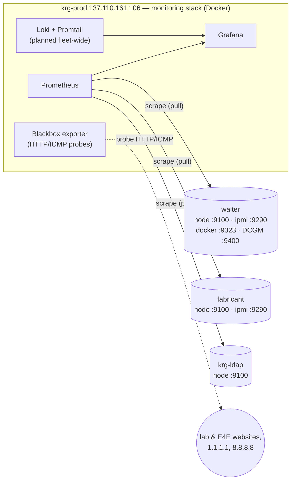

# Fleet inventory & monitoring map

Canonical list of every machine in the KRG infrastructure — IP, role, config
layer, and (for VMs) hypervisor + VMID — plus how monitoring is wired. IPs are
otherwise scattered across [`nix/networks/trusted.json`](../nix/networks/trusted.json)
comments and per-host configs; this is the one table to update when they change.

> **Related:** topology diagrams for [waiter](waiter-topology.md) ·
> [fabricant](fabricant-topology.md) · [krg-ldap](krg-ldap-topology.md).

## Hosts

| Host | IP | FQDN | Role | Config layer | Hypervisor / kind | VMID |
|---|---|---|---|---|---|---|
| **fabricant** | 137.110.161.98 | fabricant.ucsd.edu | Proxmox VE hypervisor; NFS server | Ansible (`proxmox`) | physical | — |
| **waiter** | 137.110.161.67 | waiter.ucsd.edu | GPU/FPGA compute (`compute` profile) | NixOS flake | physical | — |
| **krg-ldap** | 137.110.161.109 | krg-ldap.ucsd.edu | Samba AD DC, `KRG.LOCAL` (`directory`) | NixOS flake | VM on fabricant | 100 |
| **krg-prod** | 137.110.161.106 | krg-prod.ucsd.edu | Lab-wide services (`server` profile) | NixOS flake | VM (hypervisor TBD) | TBD |
| **e4e-prod** | TBD | e4e-prod.ucsd.edu | E4E services (scaffold, `server`) | NixOS flake | VM (hypervisor TBD) | TBD |
| **e4e-nas** | 132.239.17.124 | e4e-nas.ucsd.edu | Synology NAS (krg-prod storage) | (separate IaC effort) | appliance | — |
| ~~krg-ad~~ | 137.110.161.107 | krg-ad.ucsd.edu | **OLD AD — being decommissioned** (breached) | — | — | — |

Other fixed addresses:

| Thing | Value | Where |
|---|---|---|
| Default gateway | 137.110.161.1 | every host's `networking.defaultGateway` |
| Monitoring host (Prometheus) | 137.110.161.106 (krg-prod) | `trusted.json` `monitoring_host` |
| AD DNS / KDC | 137.110.161.109 (krg-ldap) | `krg.adClient.serverIp`; pinned in `/etc/hosts` |
| Site DNS fallbacks | 132.239.0.252, 8.8.8.8, 1.1.1.1 | host `networking.nameservers` (after the DC) |
| Ops admin IPs (off-campus) | 97.252.106.89 (chris), 107.132.34.148 (sean) | `trusted.json` `ipsets.ops` |

> krg-prod/e4e-prod don't pin a static IP in the flake (no `networking.interfaces.*`
> address) — krg-prod's .106 comes from `trusted.json`; e4e-prod is an unplaced
> scaffold. Fill `TBD` once they're deployed and their hypervisor/VMID are known.

## Trusted-network IPSets

Defined once in [`trusted.json`](../nix/networks/trusted.json), consumed by both
layers (nix `krg.firewall`, Ansible `proxmox_firewall` cluster.fw, fail2ban
allow-lists). Summary:

| IPSet | Contents | Used for |
|---|---|---|
| `public` | `0.0.0.0/1` + `128.0.0.0/1` (the whole internet) | compute SSH |
| `sealab` | Sealab wifi `132.239.10.0/24`, e4e-nas, krg-prod, krg-ldap, old krg-ad | DC↔member SMB/RPC; fail2ban ignore |
| `ucsd` | `100.0.0.0/8`, `128.54.0.0/16`, `137.110.0.0/16`, + sealab hosts | service SSH, PVE UI, AD client ports |
| `ops` | off-campus admin IPs (chris, sean) | SSH + PVE UI from off-campus |

## Monitoring map

Prometheus runs on **krg-prod** (Docker compose stack) and scrapes exporters
across the fleet. Each host's in-guest firewall opens the exporter ports **only
to the monitoring host** (`krg.firewall.monitoringPorts` ← `monitoringSourceIp`);
on Proxmox hosts the same restriction is in `cluster.fw`.

### Exporters by host

| Exporter | Port | Source | Hosts | Notes |
|---|---|---|---|---|
| node_exporter | 9100 | native systemd (nix) / systemd (ansible) | all | + ZFS pool-health textfile collector ([`zfs.nix`](../nix/modules/zfs.nix)) |
| ipmi_exporter | 9290 | native systemd | waiter, fabricant, krg-prod | compute + hypervisor + servers |
| DCGM exporter | 9400 | Docker (CDI GPU) | waiter (+ any GPU host) | coupled to the NVIDIA driver ([`nvidia.nix`](../nix/modules/hardware/nvidia.nix)) |
| docker metrics | 9323 | dockerd | waiter | Docker daemon metrics endpoint |

> ⚠️ **The committed Prometheus scrape config is stale.** [`prometheus.yml`](../nix/docker-compose/krg-prod/prometheus/prometheus.yml)
> still targets the *old* hostnames (`fabricant.ucsd.edu`, `fabricant-prod.ucsd.edu`,
> `kastner-ml.ucsd.edu`) and keeps a dead `ansible_deploy_monitor` job on `:9000`
> (replaced by `system.autoUpgrade` — now connection-refused). Updating it to the
> hosts above is the **DNS/URL migration** tracked in `CLAUDE.md` "Pending Items".
> Blackbox probe targets (E4E/lab websites) are independent of this and still valid.
