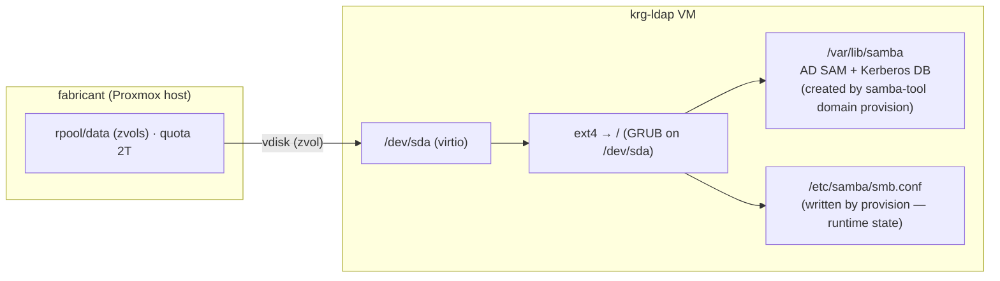
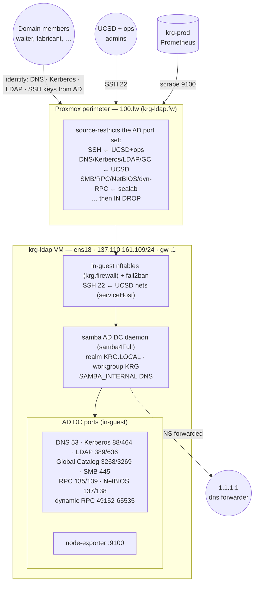

# krg-ldap — storage & network topology

Reference diagrams for **krg-ldap**, the Samba **Active Directory domain
controller** for the new `KRG.LOCAL` forest. It is a NixOS VM (Proxmox guest
**VMID 100** on the `fabricant` hypervisor) at 137.110.161.109, configured by the
flake via [`profiles/directory.nix`](../nix/profiles/directory.nix).

- Host config: [`nix/hosts/krg-ldap/default.nix`](../nix/hosts/krg-ldap/default.nix)
- AD DC module: [`nix/modules/samba-ad.nix`](../nix/modules/samba-ad.nix)
- User runbook: [`docs/creating-a-user.md`](creating-a-user.md)

> **Related:** [waiter](waiter-topology.md) · [fabricant](fabricant-topology.md).
> krg-ldap is the identity root every other host depends on — and a **single point
> of failure** until a second DC lands (see `CLAUDE.md` pending items).

---

## Storage

krg-ldap is a plain Proxmox guest: **one virtio disk, ext4 root, GRUB on
`/dev/sda`** — no ZFS-on-root and **no impermanence** (unlike waiter). Its vdisk is
a zvol living under fabricant's capped `rpool/data`. The AD databases under
`/var/lib/samba` are created by a one-time on-box `samba-tool domain provision`
(stateful — not expressible in Nix), so they are durable VM state, **not** a flake
artifact.

| path | fs | role |
|---|---|---|
| `/` | ext4 (`/dev/sda`) | OS root; vdisk = zvol on fabricant `rpool/data` |
| `/var/lib/samba` | (on `/`) | AD SAM + Kerberos DB — provisioned on-box, durable |
| `/etc/samba/smb.conf` | (on `/`) | written by provision; Nix never owns it |

---

## Network

krg-ldap serves identity (DNS, Kerberos, LDAP, SMB, Global Catalog) to the whole
fleet. Two firewall layers guard it: the **in-guest** NixOS firewall
(`samba-ad.nix` opens the AD DC port set) and the **Proxmox perimeter**
(`100.fw` / [`krg-ldap.fw`](../ansible/roles/proxmox_firewall/files/krg-ldap.fw))
which source-restricts that same set. SSH is `serviceHost` — restricted to trusted
UCSD nets in-guest. Its own resolver is **itself** (127.0.0.1 → Samba internal
DNS), forwarding non-AD queries upstream.

### Ports served (in-guest, restricted again at `100.fw`)

| port(s) | proto | purpose | perimeter source |
|---|---|---|---|
| 53 | tcp/udp | DNS (Samba internal) | `ucsd` |
| 88, 464 | tcp/udp | Kerberos / kpasswd | `ucsd` |
| 389, 636 | tcp (+udp 389) | LDAP / LDAPS / CLDAP | `ucsd` |
| 3268, 3269 | tcp | Global Catalog (+SSL) | `ucsd` |
| 445 | tcp | SMB | `sealab` |
| 135, 139 | tcp | RPC endpoint mapper / NetBIOS session | `sealab` |
| 137, 138 | udp | NetBIOS name / datagram | `sealab` |
| 49152-65535 | tcp | dynamic RPC (DRSUAPI, join, MMC) | `sealab` |
| 22 | tcp | SSH | `ucsd` + `ops` |
| 9100 | tcp | node-exporter | `krg-prod` |

> **Provisioning is manual & one-time.** The flake makes the box *ready* but the
> daemon stays inactive (`ConditionPathExists=/var/lib/samba/private/sam.ldb`)
> until `samba-tool domain provision` creates the forest — see the runbook in
> [`samba-ad.nix`](../nix/modules/samba-ad.nix). **SPOF:** every host's login
> depends on this single DC; the SSSD offline cache + local break-glass admins are
> the only continuity if it's down.
