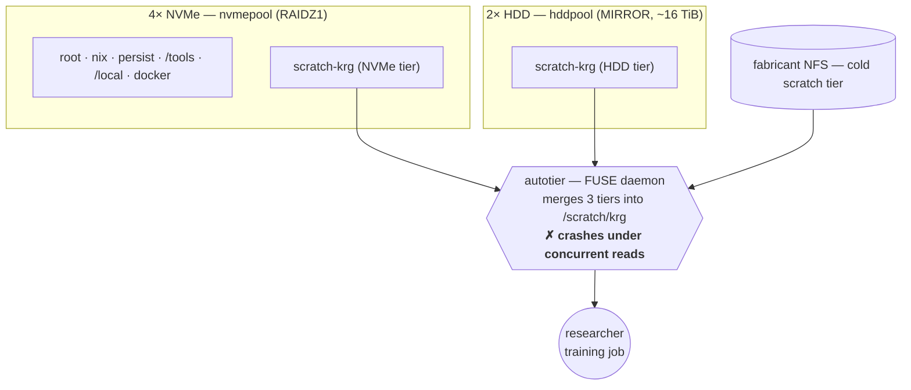
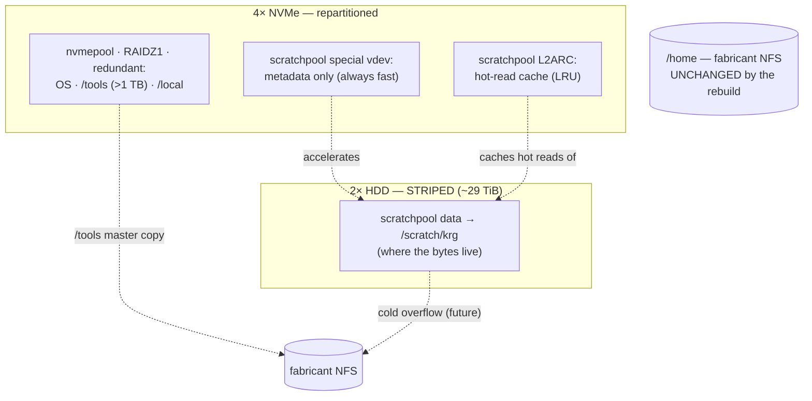
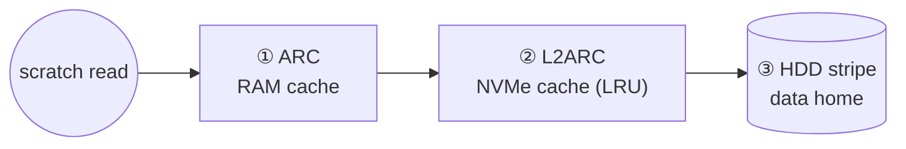

# Scratch storage redesign — decision proposal

> **Status:** Proposed — seeking buy-off · 2026-05-24
> **Scope:** `/scratch` on **waiter** (the KRG research/compute box). Does **not** touch `/home`.
> **Decision needed:** approve **Option A (rebuild now)** vs **Option B (no rebuild)** — see [Recommendation](#recommendation).

## TL;DR

`/scratch` on waiter is currently backed by **autotier**, a FUSE tiering tool that
**crashes under real ML training load** (a multi-worker dataloader reading many
small files). It's reproducible in seconds, the tool is unmaintained, and it is not
fixable by configuration — so scratch is effectively **unusable for training** today.

We have two ways forward:

- **Option A — Greenfield (recommended):** a one-time, scheduled **rebuild** of
  waiter's local storage to a ZFS-native design (no FUSE, no custom code, self-managing).
  It's the *correct* end-state for this hardware, and it is **cheapest to do right now**
  (weekend, only 2 active accounts, already a validation exercise).
- **Option B — Brownfield:** **no rebuild** — drop autotier, run scratch directly on
  NVMe, and add a small background job that archives cold files to NFS. Unblocks
  training immediately with zero downtime, but it's a workaround we'd own and maintain,
  and we'd likely end up doing the rebuild later anyway (two disruptions instead of one).

**Recommendation: Option A, scheduled now.** Option B is the fallback if a maintenance
window can't be taken. Either way we drop autotier.

---

## 1. Why we're here

### The failure
`/scratch/krg` uses **autotier 1.2.0** (a 45Drives FUSE filesystem that transparently
moves files NVMe → HDD → NFS by access frequency). Under a real training run — a
48-worker dataloader reading thousands of small `.npy` files concurrently — the
autotier daemon **aborts (SIGABRT)** within seconds, the `/scratch` mount goes to
"Transport endpoint is not connected," and the service crash-loops.

Root cause (confirmed on-box): autotier writes a **RocksDB metadata record on every
file open/close** (access-frequency tracking). A concurrent small-file read flood
overwhelms that write path and the daemon throws an unhandled exception. We verified:

- It is **not** a file-descriptor limit (crashed with `LimitNOFILE` raised to 524288).
- It is **not** corrupt metadata (a fresh database still crashes under load).
- There is **no configuration** to disable or throttle the per-access tracking.
- **autotier 1.2.0 is the latest release (Dec 2021)** and the project is effectively
  unmaintained — there's no upgrade that fixes this.

**Conclusion: autotier is the wrong tool for this workload, and it's coming out** in
both options below. The data itself was never at risk — it lives on the underlying
disks; only the FUSE merge layer crashes.

### What scratch has to do
- Serve **concurrent small-file reads** (the training hot path) fast.
- Be **self-managing** — no one hand-placing data or policing people to clean up.
- Hold **more than the NVMe** as work accumulates (12 researchers).
- Keep **NFS as the capacity backstop** — accumulated work should end up on central
  storage *automatically*, without anyone being chased to move it.

---

## 2. The constraints (the hardware is fixed)

| | |
|---|---|
| NVMe | 4 × 4 TB (~16 TB raw) — **no free slots**, can't add more |
| HDD | 2 × 16 TB |
| Budget | **No storage purchases** (AI-boom pricing) — this hardware is what we have |
| Users | 12 researchers; **multiple may run concurrently** with *different* workloads (GPU / CPU / FPGA) — rarely all 12 at once |
| Data | Training caches are **regenerable**; foundation-model (>8 TB hot) is *future*, to be designed around this system |
| `/home` | Lives on **fabricant over NFS** — **not affected** by anything here |
| `/tools` | >1 TB of FPGA toolchains (Vivado/Vitis); **hot path** for some researchers; read-only at runtime |

The decisive implication: **8 TB of NVMe cannot hold 12 researchers' data**, and we
can't add NVMe — so capacity must come from the HDD + NFS, with NVMe used as a *cache*
for the currently-active working sets. Because researchers run **concurrently** (mixed
GPU/CPU/FPGA), the cache holds the *sum* of those active sets and is a shared LRU —
workloads can evict each other. That's an inherent limit of one finite cache, managed by
tuning ([Concurrency and contention](#concurrency-and-contention)), not eliminated.

---

## 3. Decisions common to both options

These hold regardless of which option is chosen:

- **Retire autotier.** It's unfit for the workload and unmaintained.
- **`/home` stays on fabricant NFS.** Durable, read-write, single-authority. Untouched.
- **`/tools` = local NVMe copy + a master on fabricant.** It's read-only at runtime, so
  it's safe to replicate: keep it local for hot-path speed, master it on fabricant so a
  rebuild *restores* it (no reinstalling Vivado/Vitis) and future boxes can seed from it.
- **Sharding becomes the data-layout standard.** Packing caches into large shards
  (WebDataset/tar/MDS) instead of millions of tiny files is what makes HDD and NFS reads
  fast and keeps metadata small. It's load-bearing for either option.
- **Enable `smartd`** so the (intermittently flaky) `sdb` disk is monitored.

### Patching & reboot policy
Researchers run long, **concurrent** jobs (GPU / CPU / FPGA), so waiter can't reboot on
demand. NixOS fits this without leaving us unpatched:

- **Routine security patches apply live** — `nixos-rebuild switch` installs new packages
  and restarts changed services *in place*, **no reboot**. Only the **kernel** waits for a reboot.
- **`system.autoUpgrade` runs `switch` with `allowReboot = false`** — the box stays
  patched continuously; **reboots are scheduled by us**, around jobs, never automatic.
- **`restartIfChanged = false` on long-running / user-facing services** (scratch, etc.) so
  a live patch never bounces a running GPU/FPGA job.
- **Reboots batch into the standing ~90-day window** — that's when staged **kernel**
  updates (and any **release upgrade**) take effect and we re-validate the boot path while
  watching. (Stock NixOS has no live *kernel* patching, so a critical kernel CVE is the one
  thing that can force a window sooner.)

Identical on 25.11 and 26.05, so it doesn't gate the OS-version choice.

### Concurrency and contention
Multiple mixed workloads share one box and one finite NVMe cache, so:

- **Cap the ZFS ARC (`zfs_arc_max`) and run `earlyoom`.** A RAM-hungry CPU/FPGA job
  competing with ARC for memory must not starve the cache into uselessness or OOM the box.
- **Per-user scratch quotas** (`zfs userquota@…`) so one researcher filling scratch can't
  break everyone else's running jobs.
- **Honest limit:** ZFS has **no per-user I/O QoS** — concurrent heavy jobs *can* contend
  on the disks. This redesign fixes capacity and caching, **not** I/O fairness; that's a
  scheduler/cgroup or separate-box concern if it ever bites.

---

## 4. Option A — Greenfield (rebuild)

**Idea:** rebuild waiter's local pools (via `disko`, the same way it was first
installed over IPMI) into a **ZFS-native tiered design** — and let ZFS do the tiering
that autotier failed at.

- **Data lives on the HDD**, which we **stripe** to **~29 TiB** (double the mirror's
  capacity; safe *because scratch is regenerable*).
- **NVMe is an LRU read cache** (ZFS ARC in RAM + L2ARC on NVMe). The active working
  set caches onto NVMe automatically; **cold data falls off the cache on its own** as
  new data is read — exactly the "old falls off, new stays hot" behavior we want, with
  no watermarks and no mover.
- **Metadata always lives on NVMe** (a small metadata-only "special vdev"), so directory
  listings / `find` stay fast even over 29 TiB.
- Capacity beyond ~29 TiB (future) spills to fabricant NFS via a *thin* overflow job.

### Disk structure: today → proposed

**Today** — autotier (a FUSE daemon) stitches three tiers into `/scratch/krg`, and crashes
under concurrent reads:

**Proposed** — ZFS does the tiering itself: data on striped HDD, hot reads cached on NVMe,
no FUSE in the path:

`scratchpool` is **one** pool spanning the HDD data + the two NVMe partitions (`special`
for metadata, `L2ARC` for hot reads); `nvmepool` (redundant) keeps the OS, `/tools`, and
`/local`. `/home` is on fabricant and **never moves**.

### How a scratch read works (no FUSE, no mover)

Served from the fastest tier that has it — RAM, then NVMe cache, then HDD. The active
working set stays on NVMe automatically; the **coldest cached data falls off** (still safe
on HDD) to make room for what's hot now. Metadata always lives on NVMe, so listings stay
fast. No FUSE layer, no background mover — ZFS does it in-kernel.

**Why it's the right end-state:**
- **Transparent** — one namespace, no symlinks, nothing for users to "go find."
- **Self-managing** — ZFS LRU handles hot/cold; no custom code in the hot path.
- **No FUSE anywhere** — it's all in-kernel ZFS; the failure class that bit us is gone.
- It **validates the real architecture**, which is the stated point of the current exercise.

**What it costs:**
- A **scheduled maintenance window** for a destructive rebuild (`disko` wipes all of
  waiter's *local* disks). Estimate: **a few hours; budget a half-day.**
- **Stage data to fabricant first:** `/tools` (>1 TB) + the current ~2.6 TB scratch →
  ~3.6 TB over the LAN (~1 h up, ~1 h to restore). `/tools` must be restored; scratch
  can be restored or regenerated.
- **Re-join AD** (one documented step) and **new SSH host-key fingerprints** on reconnect.

**Risks accepted (by choosing the HDD stripe):**
- **No redundancy on scratch** — if either HDD (notably the flaky `sdb`) fails, the
  scratch pool is lost and **regenerated**. Accepted because the data is regenerable and
  it doubles capacity (16 → 32 TB). `smartd` gives advance warning.
- **Writes and first/cold reads hit the HDD** (the cache accelerates *re*-reads). Mitigated
  by sharding (sequential HDD I/O is fast) and by repeated-epoch training warming the cache.

---

## 5. Option B — Brownfield (no rebuild)

**Idea:** keep the existing pools; **drop autotier**; run `/scratch/krg` directly on the
existing NVMe dataset; add a small **background "garbage-collector"** that moves cold
files off to NFS as space fills, leaving a breadcrumb so people can self-recover.

- `/scratch/krg` = a **plain NVMe dataset**, direct-mounted. Training reads plain files —
  **no FUSE, no daemon in the read path** — so the autotier failure can't recur.
- A **`systemd` timer** watches usage; when NVMe fills, it moves the **coldest files** to
  fabricant NFS (optionally via the HDD as a warm middle tier), **replaces each with a
  symlink** to the NFS copy, and writes an `ARCHIVED.txt` note. The path still works
  (reads over NFS); a `scratch-restore` helper pulls a file back to fast storage —
  **self-service, no admin involvement.**

**Why it's attractive:**
- **No rebuild** — zero downtime, zero risk to the box; unblocks training in minutes.
- **No FUSE in the hot path** — only cold/archived files redirect via symlink.
- **Automatic + self-service** — meets the "no policing, recoverable without me" bar.
- Uses existing datasets (non-destructive `zfs set` only).

**What it costs / risks:**
- **Bespoke code we own and maintain** — the mover's correctness (atomic copy→verify→
  symlink, restore, manifests, surviving a crash mid-move) is on us.
- **NVMe is the data *home*, not a cache** — capacity is the ~8 TB NVMe before archiving
  kicks in; the "old falls off" is approximated by the mover (access-time + watermarks),
  not true ZFS LRU.
- **Symlink / "go find it" UX** instead of a transparent namespace.
- **It's a workaround.** When capacity or the foundation-model work forces the proper
  tiering, we'd do the rebuild anyway → **two disruptions instead of one.**

---

## 6. Side-by-side

| | **A — Greenfield (rebuild)** | **B — Brownfield (no rebuild)** |
|---|---|---|
| Rebuild / downtime | Yes — scheduled window (~half-day) | **No** — zero downtime |
| Unblocks training | After the rebuild | **Immediately** |
| FUSE in hot path | No (in-kernel ZFS) | No (plain files) |
| "Old falls off, hot stays" | **Native** (ZFS ARC/L2ARC LRU) | Approximated by the mover |
| Namespace | **Transparent** (no symlinks) | Symlinks + notes for archived files |
| Custom code to maintain | None (in hot path) | The mover + restore + manifest |
| Capacity | ~29 TiB local + NFS overflow | ~8 TB NVMe + NFS (+ optional HDD) |
| Redundancy (scratch) | None (striped, regenerable) | Existing (until/unless changed) |
| Validates the real design | **Yes** | No — interim workaround |
| Future rebuild likely? | This *is* it | **Yes** (→ double disruption) |

---

## 7. Recommendation — and why deferring is the *more*-work path

**Option A (greenfield), scheduled now.** Option B is the right call *only* if a
maintenance window genuinely can't be taken soon.

The case rests on one fact: **this work doesn't go away if we defer it — it grows.**

### Effort over time
| | This week | Over the next 6–12 months | Cumulative |
|---|---|---|---|
| **A — rebuild now** | one scheduled window (~half-day) | ≈ none — it's in-kernel ZFS, maintained upstream, no code of ours | **one disruption, then done** |
| **B — workaround** | quick, no downtime | maintain the mover, handle its edge cases — **and still do the rebuild** once capacity or the foundation-model work forces real tiering | **the workaround + ongoing upkeep + the rebuild anyway (two disruptions)** |

Option B is **cheaper this week and more expensive this year**, and it leaves us owning
bespoke code in a critical path indefinitely.

### Three reasons deferral costs more (not less)
1. **The migration only gets bigger.** Today: 2 accounts, ~2.6 TB to stage, a weekend,
   and it's *already* a validation exercise. Later: 12 researchers, tens of TB, production
   pressure, and a scheduling negotiation. **The cheapest rebuild window we will ever have
   is the one open right now** — every week of deferral raises the price.
2. **A workaround is a standing liability, not a one-time cost.** Bespoke tiering code is
   something we maintain, debug, and get paged for — indefinitely. The greenfield design
   has **no code of ours in the hot path** (it's ZFS doing what ZFS already does), so
   there's nothing for us to keep alive.
3. **We just paid the "defer the correct design" tax in full.** autotier was the
   low-setup, looks-easy option; its hidden work surfaced later, under real load, at the
   worst possible time — a day-plus of firefighting and blocked training. That's not a
   knock on any past decision — it's the concrete, recent reminder that **postponing the
   right design converts small visible work now into larger, less predictable work later.**

### This is a controlled change, not a leap
Precisely because big changes warrant caution, it's worth being explicit that this one is
**low-risk and rehearsed**:
- It's the **same `disko`/IPMI procedure that originally installed waiter**, documented
  step-by-step in the disaster-recovery runbook — not a new or experimental process.
- Every config change is **reviewed before any disk is touched**.
- **All data is staged to fabricant first** — nothing is lost — and **`/home` never moves.**
- Blast radius is **2 accounts**.

We're choosing the *planned, low-blast-radius* version of a change we'd otherwise be
forced into later — unplanned, with more data, under load.

---

## 8. What approving Option A means

- **A controlled, rehearsed change** — the same `disko`/IPMI procedure that built waiter,
  run from a reviewed config with data staged first. A planned operation, not an experiment.
- **A maintenance window** on waiter (a few hours; budget a half-day) to rebuild storage.
- **Blast radius is small and known:** currently **2 accounts**; `/home` is untouched
  (it's on fabricant); the OS is reproduced from the flake.
- **You accept:** scratch is regenerable and **not redundant** (a disk failure means
  regenerate, not data loss); a brief outage; and **SSH host-key fingerprints will change**
  (you'll re-accept them on first reconnect).
- **Nothing of yours is lost:** `/tools` and current scratch are staged to fabricant
  first and restored; `/home` never moves.

---

## 9. What is *not* affected (either option)

- **`/home`** — on fabricant NFS; untouched.
- **User accounts / AD** — unchanged (Option A re-joins the machine to AD, a documented
  one-time step; user identities are unaffected).
- **Other machines** — this is waiter-only.

---

## 10. Next steps if approved (Option A)

1. Draft + review the new `disko` layout, the replacement `krg.scratch` module, and an
   ADR — **no disks touched** until reviewed and data is staged.
2. Stage `/tools` + scratch → fabricant; confirm the AD re-join procedure.
3. Schedule the window; rebuild over IPMI per the disaster-recovery runbook.
4. Restore `/tools` + scratch; validate under the **real** concurrent-read training load
   (not a light read — that's the test that fooled us before).

---

## Appendix A — Proposed disko layout (Option A)

NVMe ×4 (~3.64 TiB usable each), identical partitioning:

| Partition | Size | Role |
|---|---|---|
| ESP | 2 GiB | boot — `mirroredBoots` ×4 (unchanged) |
| `os` | ~1.5 TiB | `nvmepool` **raidz1** → OS + `/tools` (>1 TB) + `/local` (1 T). Redundant; survives one NVMe failure. |
| `special` | ~128 GiB | `scratchpool` **metadata-only** special vdev (stripe). Holds only metadata, so it never fills. |
| `cache` | ~1.5 TiB | `scratchpool` **L2ARC** (stripe) → ~6 TiB total |
| (slack) | ~0.5 TiB | SSD overprovisioning |

HDD ×2 (16 TB): whole disk → `scratchpool` data, **striped** → ~29 TiB.

Carried forward verbatim from the current install (load-bearing): GRUB `mirroredBoots`
×4, the impermanence `@blank` snapshot + `/usr/bin/env` initrd reseed, the pinned
`hostId`, and `/dev/disk/by-id` device paths.

## Appendix B — Storage map (the rule)

| Class | Example | Lives | Master |
|---|---|---|---|
| Durable + **read-write** (single-authority) | `/home` | NFS (fabricant), live | — |
| Durable + **read-only at runtime** + hot | `/tools` | local NVMe replica | fabricant |
| **Regenerable** + hot | `/scratch`, `/local` | local | — |

Rule of thumb: *durable & read-write → NFS; durable & read-only & hot → local replica with
an off-box master; regenerable & hot → local.*
