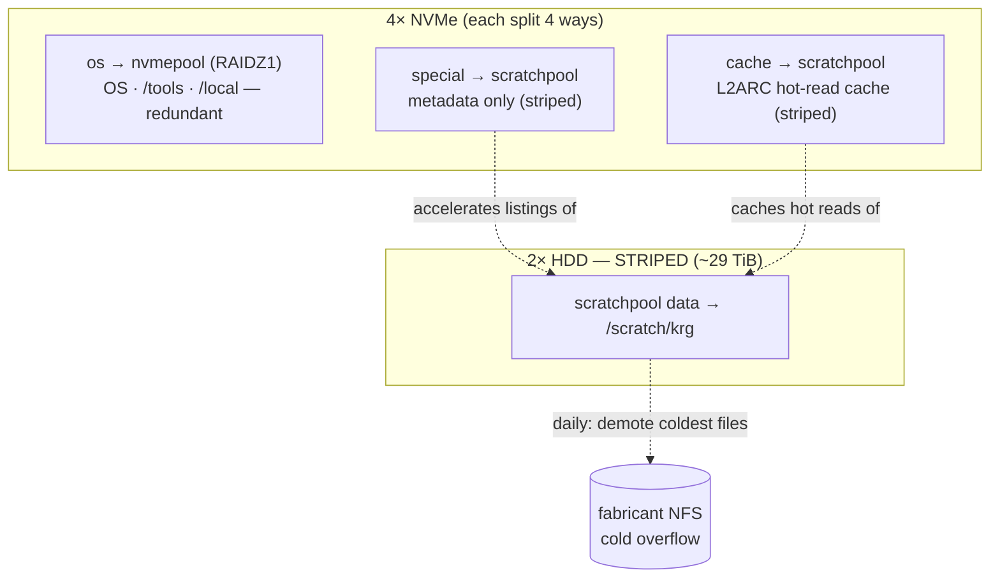
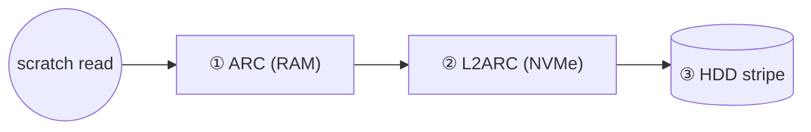

# waiter `/scratch` — the ZFS-native (greenfield) design

How `/scratch` works on waiter after the autotier rebuild, the decisions behind it,
and how to operate it. This is the **as-built** record; the options that were weighed
to get here are in the buy-off proposal (`docs/scratch-architecture-options.md` /
PR #63).

> **Related:** [waiter-topology.md](waiter-topology.md) (diagrams) ·
> [disaster-recovery.md](disaster-recovery.md) (the destructive rebuild) ·
> [troubleshooting.md](troubleshooting.md). Sources:
> [`disko-config.nix`](../nix/hosts/waiter/disko-config.nix),
> [`modules/scratch.nix`](../nix/modules/scratch.nix),
> [`modules/scratch/`](../nix/modules/scratch/) (the Python tools).

---

## Why this exists (the short version)

`/scratch` used to be tiered by **autotier**, a FUSE daemon that moved files
NVMe→HDD→NFS by access frequency. It wrote a RocksDB metadata record on every file
open/close and **aborted (SIGABRT) within seconds** under a real training run (a
multi-worker dataloader reading thousands of small files concurrently), taking the
whole `/scratch` mount down with it. It is unmaintained (last release Dec 2021) and
not fixable by configuration. So it's gone, and the FUSE failure class with it.

The replacement lets **ZFS** do the tiering autotier failed at — in-kernel, with no
daemon in the read path.

---

## The design

One pool, `scratchpool`, spanning all the storage with each medium in the role it's
good at:

- **Data → 2× 16 TB HDD, striped (~29 TiB).** Where the bytes live. Striped (not
  mirrored) to double capacity; safe **because scratch is regenerable**.
- **Metadata → NVMe "special" vdev (4× 128 GiB partitions, striped).** Metadata-only,
  so directory listings / `find` stay NVMe-fast across 29 TiB and the vdev never fills.
- **Hot reads → NVMe L2ARC (4× 1.4 TiB partitions) + RAM ARC.** The active working set
  is cached on NVMe automatically; the coldest cached data falls off on its own (LRU).

`nvmepool` (the 4× NVMe `os` partitions, RAIDZ1) is unchanged in role: redundant OS +
`/tools` + `/local`.



### How a read is served (no FUSE, no mover in the path)



Served from the fastest tier that has it. Writes and first/cold reads hit the HDD
(fast for sequential, sharded data); re-reads come from cache. Metadata is always on
NVMe.

### Overflow to NFS (the only custom code, and it's *out* of the read path)

The daily `scratch-overflow` timer ([`scratch-overflow.py`](../nix/modules/scratch/scratch-overflow.py))
demotes files to the cold NFS area on fabricant for **two** reasons, both keyed on
last-access time (`relatime`):

- **TTL sweep (every run):** any file **not accessed in 6 months** (`maxIdleDays = 180`)
  is demoted regardless of how full the pool is — automatic GC of genuinely-abandoned
  data. Because it's keyed on *access*, an actively-read dataset is **never** evicted by
  this, no matter how old it is.
- **Capacity sweep (when full):** when `scratchpool` is past **85%**, the
  least-recently-accessed files (skipping anything touched in the last **14 days**) are
  demoted, coldest first, until the pool drops below **75%**.

`/scratch` has ~29 TiB and current use is a couple of TB, so the *capacity* sweep rarely
fires today; the *TTL* sweep is what keeps stale data from accumulating in the meantime.
For each file the job copies it to `/srv/scratch-cold/krg`, **fsyncs and verifies it
(size + full sha256)**, and only then **atomically replaces the local file with a
symlink** to the NFS copy (the manifest records which sweep moved it).

The path keeps working (reads follow the symlink over NFS, just slower). A breadcrumb
(`WHERE-IS-MY-DATA.txt`) is dropped at the scratch root. To pull a file back to fast
storage, a user runs **`scratch-restore <path>`** (or a directory) — self-service, no
admin. It's **fail-closed**: if the cold NFS area is down the unit won't even start
(`RequiresMountsFor`), and a local file is *never* unlinked until its NFS copy verifies.

---

## Decisions & rationale

| Decision | Why |
|---|---|
| **Striped special vdev** (not mirrored) | Matches the data vdev's no-redundancy (so `zpool create` needs no `-f`), same regenerable bet. Trade-off: losing **any** NVMe `special` partition loses the pool → regenerate. (Mirroring it was the safer alternative; striping was the chosen call for max metadata space + consistency.) |
| **Snapshots OFF on `scratch-krg`** | Regenerable data, **and** snapshots would pin the blocks the overflow job frees when it demotes to NFS — defeating capacity relief. The cold copies on fabricant NFS *are* snapshotted, so archived data keeps accidental-delete protection. |
| **`relatime` on the scratch dataset** | The overflow mover needs last-*access* to pick cold files. `atime=off` (pool default) would hide it; `mtime` would wrongly treat an actively-read-but-unmodified shard as cold. `relatime` is the low-overhead middle. |
| **Overflow tooling in Python** (not Rust/shell) | Correctness-critical (it deletes local data after copying), so it needs real error handling — but it must stay **inspectable and maintainable by the researcher-admins**, with no compile step or new toolchain in a Nix+shell repo. Small, stdlib-only, fail-closed, unit-tested. (Rust was considered; rejected on bus-factor + the autotier lesson of an opaque tool nobody could fix.) |
| **ARC cap (96 GiB) + earlyoom** | Mixed GPU/CPU/FPGA jobs share one box and one finite cache; the cap stops ARC starving a RAM-hungry job, earlyoom handles real pressure gracefully. 96 GiB ≈ 25% of waiter's 377 GiB (ZFS default ~50% is too much to hand a shared ML box); the ~5.6 TiB L2ARC sits under it, adding only ~0.4 GB of ARC headers at the 1M recordsize. Tune with `arcstat`. |
| **smartd enabled** | The striped scratchpool has **no redundancy**, so advance warning of a failing disk (esp. the historically flaky `sdb`) matters. No MTA here → escalate via `wall` + journal; pool-level state still goes to Prometheus via the zpool-health textfile collector. |
| **Sharding is the data-layout standard** | Packing caches into large shards (WebDataset/tar/MDS) instead of millions of tiny files is what makes HDD + NFS reads fast and keeps metadata small. Load-bearing for this design. |

### Honest limits
- **No redundancy on scratch.** A single HDD *or* `special`-NVMe failure loses the
  pool → **regenerate**. Accepted (regenerable + double capacity + smartd warning).
- **No per-user I/O QoS.** ZFS has none; concurrent heavy jobs can contend on the
  disks. This fixes capacity + caching, not I/O fairness (a cgroup/scheduler concern
  if it ever bites). Per-user **space** fairness is `zfs userquota@…` (set per user
  on-box as needed; AD uids are dynamic so it's not declarative yet).

---

## Operating it

```bash
# what would overflow right now, without touching anything:
sudo scratch-overflow --pool scratchpool --scratch /scratch/krg \
  --cold /srv/scratch-cold/krg --high 85 --low 75 \
  --min-age-days 14 --max-idle-days 180 --dry-run

# pull an archived file (a symlink) back to fast local storage:
scratch-restore /scratch/krg/<user>/path/to/file        # one file
scratch-restore /scratch/krg/<user>/some/dir            # everything archived under a dir

# see the overflow history / timer:
sudo cat /scratch/krg/.scratch-overflow/manifest.jsonl
systemctl status scratch-overflow-krg.timer

# tune the ARC cap (after checking RAM + arcstat hit rate):
#   edit krg.zfs.arcMaxBytes in hosts/waiter/default.nix, then nixos-rebuild
```

**Where to put work** (push people here to keep `/home` NFS healthy):
- **Active datasets / training caches / `git clone` of big repos → `/scratch/krg/<you>`**
  (fast local, regenerable, auto-overflows when full). A convenience symlink
  **`~/scratch`** points there, created on login (a real `~/scratch` is never clobbered).
  Note it's *machine-local* despite living in your NFS home — it's this box's scratch.
- **Code + results you must keep → `/home`** (NFS, backed up).
- **IDE servers + tool caches → `/local/<you>`** (handled automatically by
  `krg.localCache`; see [waiter-topology.md](waiter-topology.md)).

---

## Deploying the rebuild

This is a **destructive** rebuild (disko repartitions every local disk). Do **not**
re-run `disko --mode disko` on the live box casually. The full procedure — stage
`/tools` + scratch to fabricant first, rebuild over IPMI, re-join AD, validate under a
**real** concurrent-read training load — is in
[disaster-recovery.md](disaster-recovery.md) ("waiter — ZFS-on-root + impermanence").

> The one validation that matters: re-run the **actual** multi-worker training read
> that killed autotier. A light read is the test that fooled us before.
