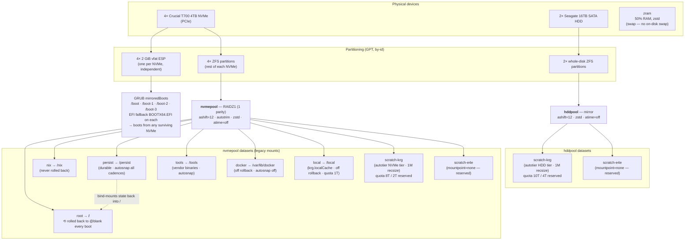
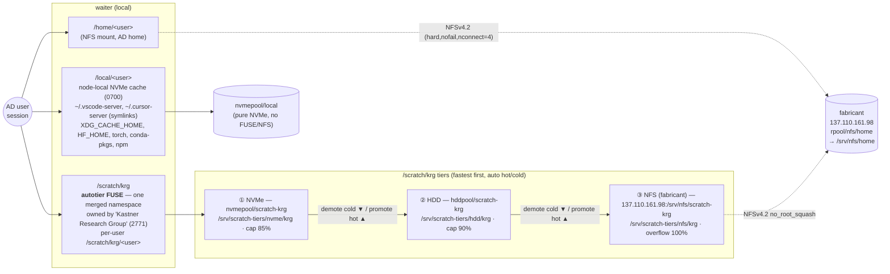

# waiter — storage & network topology

Reference diagrams for **waiter**, the KRG research/compute box (physical, AMD
Threadripper PRO 7985WX, 137.110.161.67). Everything here is derived from the
flake — the authoritative sources are linked inline; if the diagrams and the
`.nix` ever disagree, the `.nix` wins.

- Host config: [`nix/hosts/waiter/default.nix`](../nix/hosts/waiter/default.nix)
- Disk layout: [`nix/hosts/waiter/disko-config.nix`](../nix/hosts/waiter/disko-config.nix)
- Bootloader/hardware: [`nix/hosts/waiter/hardware-configuration.nix`](../nix/hosts/waiter/hardware-configuration.nix)
- Compute profile: [`nix/profiles/compute.nix`](../nix/profiles/compute.nix) → [`base`](../nix/profiles/base.nix)

> **Related:** [fabricant](fabricant-topology.md) · [krg-ldap](krg-ldap-topology.md).
> Mermaid diagrams render inline on GitHub. `fabricant` = the Proxmox **hypervisor**
> (137.110.161.98) that serves NFS and hosts the `krg-ldap` AD DC VM
> (137.110.161.109); `krg-prod` (137.110.161.106) runs Prometheus.

---

## Storage

waiter is **ZFS-on-root with an impermanent (erase-your-darlings) root**: every
boot `nvmepool/root` is rolled back to its empty `@blank` snapshot, so durable
state must live either on a non-rolled-back dataset (`/nix`, `/persist`,
`/tools`, `/var/lib/docker`, `/local`) or be bind-mounted back from `/persist`.
User data lives **off the box** — `/home` over NFS and `/scratch/krg` tiered down
to NFS — so the rollback never touches it.

### Physical → pools → datasets



**`/persist` → `/` bind mounts** (what survives the rollback — see
[`modules/impermanence.nix`](../nix/modules/impermanence.nix)):
`/var/log`, `/var/lib/nixos` (uid/gid map), `/var/lib/systemd`,
`/var/lib/fail2ban` (ban DB), `/var/lib/sss` (SSSD offline cache),
`/var/lib/krg` (compose working dir + secrets + monitoring data),
`/var/lib/autotier` (tier popularity DB), `/root`, `/etc/nixos`,
`/var/lib/krg-admin` (break-glass home); files `/etc/machine-id`, the SSH host
keys, `/etc/krb5.keytab` (AD membership).

| dataset | mount | pool | rolled back? | snapshots |
|---|---|---|---|---|
| `nvmepool/root` | `/` | nvmepool (raidz1) | **yes, → `@blank`** | off |
| `nvmepool/nix` | `/nix` | nvmepool | no | off |
| `nvmepool/persist` | `/persist` | nvmepool | no | all cadences |
| `nvmepool/tools` | `/tools` | nvmepool | no | all cadences |
| `nvmepool/docker` | `/var/lib/docker` | nvmepool | no | off |
| `nvmepool/local` | `/local` | nvmepool | no | off (quota 1T) |
| `nvmepool/scratch-krg` | autotier NVMe tier | nvmepool | no | daily/weekly/monthly |
| `hddpool/scratch-krg` | autotier HDD tier | hddpool | no | daily/weekly/monthly |

### Logical view — what users see (`/home`, `/scratch`, `/local`)



Notes:
- **`/scratch/krg`** is one [autotier](../nix/modules/scratch.nix) FUSE namespace
  that keeps the working set on NVMe and drains cold files NVMe → HDD → fabricant
  NFS (daily pass). It **fails closed**: if the NFS cold tier is down the
  `autotier-krg` unit won't start (so it never demotes onto the impermanent root).
- **`/home`** is a plain `nofail` NFSv4.2 mount ([`nfs-home.nix`](../nix/modules/nfs-home.nix)),
  pinned to fabricant by IP so it never waits on DNS. A PAM **login gate** denies
  any AD user whose home is under `/home` while that mount is down — closing the
  impermanence data-loss window. Break-glass `krg-admin` (home `/var/lib/krg-admin`)
  is unaffected and keeps the box recoverable.
- **`/local`** ([`local-cache.nix`](../nix/modules/local-cache.nix)) is the
  deliberately boring counterpart: pure local NVMe for hot, watch-heavy,
  regenerable state that has no business on NFS. The symlink is never created over
  an existing real `~/.vscode-server`.

### Python environments (uv, poetry, pip)

A virtualenv is thousands of small files that get `stat`/`open`-ed constantly and
watched by your editor — exactly the workload NFS is worst at (and inotify doesn't
cross NFS, so watchers fall back to polling). Venvs are also fully regenerable from
a lockfile, so they belong on node-local **`/local`**, not the network `/home`.
`krg.localCache` already points the package **caches** (`XDG_CACHE_HOME`, `HF_HOME`,
…) at `/local/<you>/.cache`; where the **venv** lands depends on the tool:

- **poetry — already on `/local`.** Poetry stores venvs *out of project* under its
  cache dir, which follows `XDG_CACHE_HOME`, so they live in
  `/local/<you>/.cache/pypoetry/virtualenvs/`. Just don't turn on in-project venvs
  (`poetry config virtualenvs.in-project` should be `false`, the default; `true`
  puts `.venv` back on NFS).
- **pip / `python -m venv`** — the download cache is already on `/local`; create the
  environment itself there, e.g. `python -m venv /local/$(id -un)/venvs/myproj`.
- **uv — needs a per-project nudge.** uv's cache is on `/local`, **but uv creates the
  project env at `.venv` inside the project dir**, which on your NFS home means the
  venv lands on NFS. uv has no global "put venvs on /local" switch, so redirect it
  **per project**:

  ```bash
  rm -rf .venv                                                   # remove the NFS one
  export UV_PROJECT_ENVIRONMENT="/local/$(id -un)/venvs/$(basename "$PWD")"
  uv sync
  ```

  Make it stick for that project by putting the `export` in a [direnv](https://direnv.net/)
  `.envrc`, or by symlinking the venv (uv follows the link, and your editor still
  finds `./.venv`):

  ```bash
  d="/local/$(id -un)/venvs/$(basename "$PWD")"; mkdir -p "$d"; ln -s "$d" .venv
  ```

**Why bother — the hardlink trap.** uv hardlinks packages from its cache into the
venv, and hardlinks can't span filesystems. A `/local` cache + an NFS `.venv` makes
uv fall back to copying every file (slower, and it prints `Failed to hardlink files;
falling back to full copy`). Putting the venv on `/local` alongside the cache
restores fast, hardlinked installs.

**Caveats.** `/local` is *not* snapshotted or backed up
([disaster-recovery.md](disaster-recovery.md)) — fine for a venv (recreate with
`uv sync` / `poetry install`), but keep your **source** in `/home`. And don't set a
*fleet-wide* `UV_PROJECT_ENVIRONMENT`: a single static path forces every uv project
to share one venv (constant re-syncs; corruption with two concurrent shells), so
this stays a per-project setting by design.

---

## Network

waiter is **physical with a public UCSD IP** — there is no Proxmox perimeter in
front of it (that layer only guards VMs). Its single defense layer is the in-guest
nftables firewall ([`krg.firewall`](../nix/modules/security/firewall.nix)) plus
key-only SSH and fail2ban. SSH is intentionally open to the world (compute hosts
serve researchers from anywhere); RDP and the monitoring ports are restricted.


### Inbound rules

| port | service | exposure | source |
|---|---|---|---|
| 22/tcp | SSH | **open to all** | any (key-only ed25519 + fail2ban) |
| 3389/tcp | XRDP | only when `krg.fpga.enable` (currently **off**) | UCSD nets (`rdpSources`) |
| 9100/tcp | node-exporter | monitoring | `krg-prod` only |
| 9290/tcp | ipmi-exporter | monitoring | `krg-prod` only |
| 9323/tcp | docker metrics | monitoring | `krg-prod` only |
| 9000/tcp | prometheus client | monitoring | `krg-prod` only |
| 9400/tcp | DCGM GPU exporter | monitoring | `krg-prod` only |

Monitoring source = `trusted.json` `monitoring_host` (137.110.161.106). Trusted
nets (`ucsd`/`sealab`/`ops`) live in
[`nix/networks/trusted.json`](../nix/networks/trusted.json), shared with the
Ansible layer.

### Outbound dependencies

| target | purpose | how |
|---|---|---|
| `krg-ldap` 137.110.161.109 | AD membership: login, SSH keys, sudo, internal DNS | SSSD (Kerberos/LDAP); DC pinned as **primary nameserver** |
| `fabricant` 137.110.161.98 | `/home` + `/scratch/krg` cold tier | NFSv4.2 (`hard,nofail,nconnect=4`) |
| `132.239.0.252`, `8.8.8.8`, `1.1.1.1` | fallback DNS (after the DC) | resolv.conf |
| github / nix binary cache | nightly `system.autoUpgrade` (04:00) + builds | https |

> **SPOF:** every login depends on the single `krg-ldap` DC; the SSSD offline
> cache + local `krg-admin` are the only continuity if it's down. A second DC is a
> tracked follow-up (see `CLAUDE.md` pending items).
