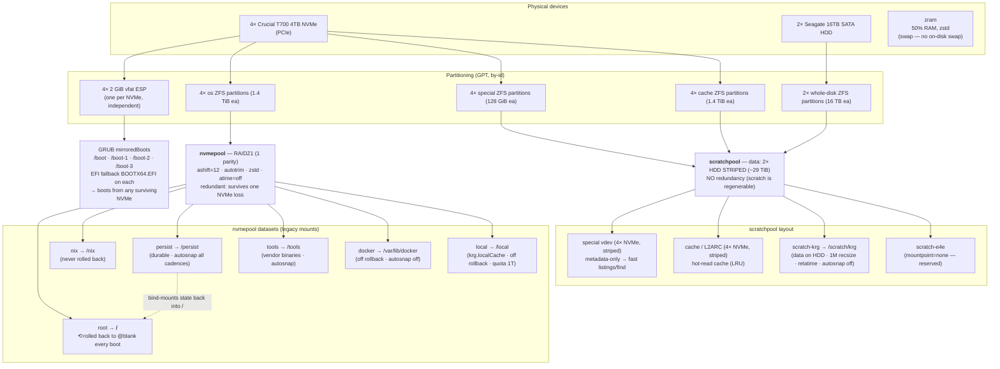
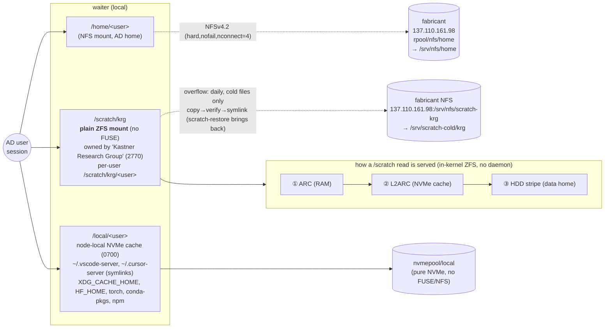
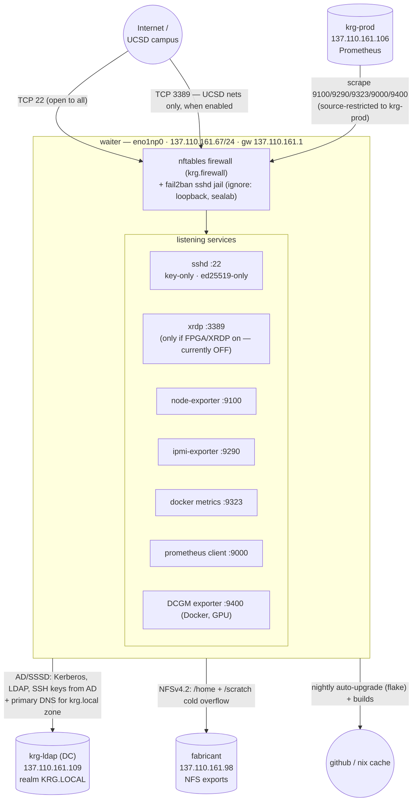

# waiter — storage & network topology

Reference diagrams for **waiter**, the KRG research/compute box (physical, AMD
Threadripper PRO 7985WX, 137.110.161.67). Everything here is derived from the
flake — the authoritative sources are linked inline; if the diagrams and the
`.nix` ever disagree, the `.nix` wins.

- Host config: [`nix/hosts/waiter/default.nix`](../nix/hosts/waiter/default.nix)
- Disk layout: [`nix/hosts/waiter/disko-config.nix`](../nix/hosts/waiter/disko-config.nix)
- Bootloader/hardware: [`nix/hosts/waiter/hardware-configuration.nix`](../nix/hosts/waiter/hardware-configuration.nix)
- Compute profile: [`nix/profiles/compute.nix`](../nix/profiles/compute.nix) → [`base`](../nix/profiles/base.nix)

> **Related:** [fabricant](fabricant-topology.md) · [krg-ldap](krg-ldap-topology.md).
> Mermaid diagrams render inline on GitHub. `fabricant` = the Proxmox **hypervisor**
> (137.110.161.98) that serves NFS and hosts the `krg-ldap` AD DC VM
> (137.110.161.109); `krg-prod` (137.110.161.106) runs Prometheus.

---

## Storage

waiter is **ZFS-on-root with an impermanent (erase-your-darlings) root**: every
boot `nvmepool/root` is rolled back to its empty `@blank` snapshot, so durable
state must live either on a non-rolled-back dataset (`/nix`, `/persist`,
`/tools`, `/var/lib/docker`, `/local`, `scratchpool`) or be bind-mounted back from
`/persist`. User data lives **off the rolled-back root** — `/home` over NFS, and
`/scratch/krg` on its own durable `scratchpool` — so the rollback never touches it.

> **Scratch is ZFS-native, not FUSE.** `/scratch` was previously tiered by
> **autotier** (a FUSE daemon) which crashed under concurrent training reads. It's
> gone — see [scratch-greenfield.md](scratch-greenfield.md). `/scratch/krg` is now a
> plain ZFS mount on `scratchpool`: bytes on the striped HDD, hot reads served by an
> NVMe metadata (special) vdev + L2ARC; a daily job overflows cold files to NFS.

### Physical → pools → datasets

**`/persist` → `/` bind mounts** (what survives the rollback — see
[`modules/impermanence.nix`](../nix/modules/impermanence.nix)):
`/var/log`, `/var/lib/nixos` (uid/gid map), `/var/lib/systemd`,
`/var/lib/fail2ban` (ban DB), `/var/lib/sss` (SSSD offline cache),
`/var/lib/krg` (compose working dir + secrets + monitoring data),
`/root`, `/etc/nixos`, `/var/lib/krg-admin` (break-glass home); files
`/etc/machine-id`, the SSH host keys, `/etc/krb5.keytab` (AD membership).
(`/scratch` needs nothing here — it's on its own durable pool.)

| dataset | mount | pool | rolled back? | snapshots |
|---|---|---|---|---|
| `nvmepool/root` | `/` | nvmepool (raidz1) | **yes, → `@blank`** | off |
| `nvmepool/nix` | `/nix` | nvmepool | no | off |
| `nvmepool/persist` | `/persist` | nvmepool | no | all cadences |
| `nvmepool/tools` | `/tools` | nvmepool | no | all cadences |
| `nvmepool/docker` | `/var/lib/docker` | nvmepool | no | off |
| `nvmepool/local` | `/local` | nvmepool | no | off (quota 1T) |
| `scratchpool/scratch-krg` | `/scratch/krg` | scratchpool (HDD stripe + NVMe special/L2ARC) | no | **off** (regenerable; see note) |

> Scratch snapshots are **off on purpose**: the data is regenerable, and snapshots
> would pin blocks the overflow job frees when it demotes a file to NFS. The cold
> copies on fabricant NFS *are* snapshotted (ansible `nfs_server`), so archived data
> still has accidental-delete protection.

### Logical view — what users see (`/home`, `/scratch`, `/local`)

Notes:
- **`/scratch/krg`** is a plain ZFS mount ([`scratch.nix`](../nix/modules/scratch.nix))
  on `scratchpool` — no FUSE daemon in the read path. ZFS serves hot reads from RAM
  (ARC) then NVMe (L2ARC); the bytes live on the striped HDD; metadata is on the NVMe
  special vdev. When the pool fills past 85%, the daily `scratch-overflow` timer demotes
  the least-recently-accessed files to fabricant NFS and leaves a symlink (reads still
  work, just over the network); `scratch-restore <path>` pulls a file back. It **fails
  closed**: if the cold NFS area is down the unit won't start, and a local file is never
  unlinked until its NFS copy is verified. See [scratch-greenfield.md](scratch-greenfield.md).
  Each member also gets a private `/scratch/krg/<user>` and a convenience **`~/scratch`**
  symlink to it, both laid on login (the symlink never clobbers a real `~/scratch`).
- **`/home`** is a plain `nofail` NFSv4.2 mount ([`nfs-home.nix`](../nix/modules/nfs-home.nix)),
  pinned to fabricant by IP so it never waits on DNS. A PAM **login gate** denies
  any AD user whose home is under `/home` while that mount is down — closing the
  impermanence data-loss window. Break-glass `krg-admin` (home `/var/lib/krg-admin`)
  is unaffected and keeps the box recoverable.
- **`/local`** ([`local-cache.nix`](../nix/modules/local-cache.nix)) is the
  deliberately boring counterpart: pure local NVMe for hot, watch-heavy,
  regenerable state that has no business on NFS. The symlink is never created over
  an existing real `~/.vscode-server`.

---

## Network

waiter is **physical with a public UCSD IP** — there is no Proxmox perimeter in
front of it (that layer only guards VMs). Its single defense layer is the in-guest
nftables firewall ([`krg.firewall`](../nix/modules/security/firewall.nix)) plus
key-only SSH and fail2ban. SSH is intentionally open to the world (compute hosts
serve researchers from anywhere); RDP and the monitoring ports are restricted.

### Inbound rules

| port | service | exposure | source |
|---|---|---|---|
| 22/tcp | SSH | **open to all** | any (key-only ed25519 + fail2ban) |
| 3389/tcp | XRDP | only when `krg.fpga.enable` (currently **off**) | UCSD nets (`rdpSources`) |
| 9100/tcp | node-exporter | monitoring | `krg-prod` only |
| 9290/tcp | ipmi-exporter | monitoring | `krg-prod` only |
| 9323/tcp | docker metrics | monitoring | `krg-prod` only |
| 9000/tcp | prometheus client | monitoring | `krg-prod` only |
| 9400/tcp | DCGM GPU exporter | monitoring | `krg-prod` only |

Monitoring source = `trusted.json` `monitoring_host` (137.110.161.106). Trusted
nets (`ucsd`/`sealab`/`ops`) live in
[`nix/networks/trusted.json`](../nix/networks/trusted.json), shared with the
Ansible layer.

### Outbound dependencies

| target | purpose | how |
|---|---|---|
| `krg-ldap` 137.110.161.109 | AD membership: login, SSH keys, sudo, internal DNS | SSSD (Kerberos/LDAP); DC pinned as **primary nameserver** |
| `fabricant` 137.110.161.98 | `/home` + `/scratch/krg` cold overflow | NFSv4.2 (`hard,nofail,nconnect=4`) |
| `132.239.0.252`, `8.8.8.8`, `1.1.1.1` | fallback DNS (after the DC) | resolv.conf |
| github / nix binary cache | nightly `system.autoUpgrade` (04:00) + builds | https |

> **SPOF:** every login depends on the single `krg-ldap` DC; the SSSD offline
> cache + local `krg-admin` are the only continuity if it's down. A second DC is a
> tracked follow-up (see `CLAUDE.md` pending items).
